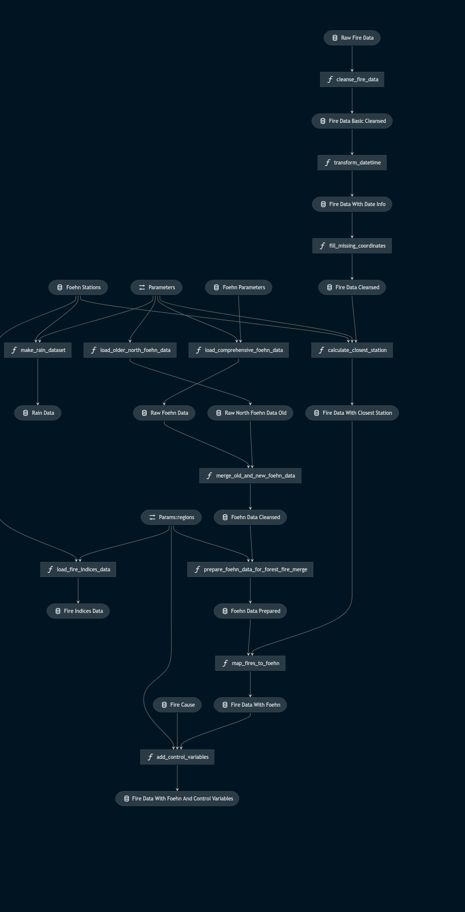

# Foehn fire impact
This project takes foehn wind and forest fire data in Switzerland of the past 40 years into account, cleanses and merges the data, and finally allows for investigation of the impact of foehn winds on forest fires. The project was originally generated with Dataiku but has been rebuilt with kedro (`Kedro 0.17.0`) for shareability, reproducibility and learning purposes. 

The whole project looks likes this (made with kedro viz):


Essentially, there are three pipelines in this project: `fire_pipeline`, `foehn_pipeline`, and `foehn_fire_pipeline`. All of them can be found under `src/foehn_fire_impact/pipelines`.

## Fire pipeline
Pipeline for the fire data only. It cleanses the raw data, transform the datetime, adds some missing coordinates, and maps each fire to the closest weather observation station.

## Foehn pipeline
Pipeline to load and cleanse two data deliveries (each having a different structure) from MeteoSwiss containing important measurement variables (e.g., the temperature, wind speed and Duerr-Index) from all foehn measurement stations in Switzerland. This pipeline loads the data, performs some cleansing, ensures a consistent time axis, and merges both deliveries. The measurements cover the period 1981-2019 and can be used for a range of analyses. 

## Foehn fire pipeline
Pipeline which maps the before preprocessed fire and foehn data onto each other and adds some control variables (i.e., fire regime, foehn type, and decade). The resulting file (which is also included in the git-commit), is then analyzed in the notebook under `notebooks/data_exploration.ipynb`.

# Getting started
If you want to run the pipelines yourself, here you find the most important kedro commands. To set up everything, simply run
```
kedro install
```

Now you can run everything, certain pipelines, or nodes via 
```
kedro run # Runs everything
kedro run --pipeline foehn_fire_pipeline # Runs the foehn_fire_pipeline pipeline only 
kedro run --node cleanse_fire_data # Runs the cleanse_fire_data node only
kedro run --from-nodes map_fires_to_foehn # Runs all nodes from the map_fires_to_foehn node (including the node itself)
```

If you want to run the notebook mentioned above (or create a new one), simply start a notebook or jupyter-lab session via kedro. This adds some variables to the session during startup and lets you access the data easily:
```
kedro jupyter notebook
kedro jupyter lab
```

There are also some unit tests pre-written for certain functions, which you can execute via
```
kedro test
```

You can visualize all pipelines via 
```
kedro viz
```

Now you are pretty much set up. If you want to learn more, take a look at the [Kedro documentation](https://kedro.readthedocs.io) at this point.